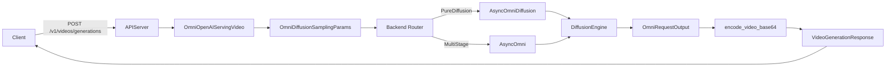

# Text-to-Video Online Serving Design

## Summary
This document describes the OpenAI-style text-to-video generation API
introduced for Wan2.2 and the shared diffusion serving path that can be reused
by other text-to-video models. The design focuses on a stable external API,
extensible request schema, and a handler that routes to either pure diffusion
or multi-stage pipelines.

## Goals
- Provide `/v1/videos/generations` for text-to-video generation.
- Keep request/response compatible with OpenAI-style conventions.
- Make the request schema extensible for future text-to-video diffusion models.
- Reuse existing diffusion execution and sampling parameters.

## Non-goals
- Streaming output (reserved for future work).
- URL-based video hosting (response format is `b64_json` only).

## New APIs
### POST `/v1/videos/generations`
OpenAI-style video generation endpoint.

**Request (core fields)**
- `prompt` (string, required)
- `model` (string, optional)
- `n` (int, default 1)
- `size` (string, `"WIDTHxHEIGHT"`, optional)
- `width`, `height` (int, optional; override `size` if set)
- `num_frames` (int, optional)
- `fps` (int, optional)
- `num_inference_steps` (int, optional)
- `guidance_scale` (float, optional)
- `guidance_scale_2` (float, optional; Wan2.2 high-noise CFG)
- `negative_prompt` (string, optional)
- `seed` (int, optional)
- `lora` (object, optional)
- `extra_body` (object, optional, model-specific extension)

**Request (extensibility)**
- `video_params` object (optional)
  - `width`, `height`, `num_frames`, `fps`

**Response**
```
{
  "created": 1730000000,
  "data": [
    { "b64_json": "<base64-mp4>" }
  ]
}
```

## Main Logic
The handler maps request fields to `OmniDiffusionSamplingParams`, routes to
the correct execution backend, extracts the video output, and encodes MP4
to base64.



## Components and Files
- Protocol schema: `vllm_omni/entrypoints/openai/protocol/videos.py`
- API utils: `vllm_omni/entrypoints/openai/video_api_utils.py`
- Handler: `vllm_omni/entrypoints/openai/serving_video.py`
- Routing: `vllm_omni/entrypoints/openai/api_server.py`
- Compatibility: `vllm_omni/entrypoints/async_omni.py`
- Example: `examples/online_serving/text_to_video/run_curl_text_to_video.sh`

## Routing Details
1. Parse request and assemble `OmniDiffusionSamplingParams`.
2. Determine backend:
   - **Pure diffusion**: single diffusion stage; use `AsyncOmni` or
     `AsyncOmniDiffusion` depending on server configuration.
   - **Multi-stage**: build `sampling_params_list` aligned with stage types.
3. Extract video outputs from `OmniRequestOutput`.
4. Encode MP4 with `diffusers.utils.export_to_video`.
5. Return `VideoGenerationResponse` with `b64_json`.

## Extensibility Notes
- `extra_body` is retained and passed into `sampling_params.extra_args`.
- `video_params` provides a reserved space for future video-specific fields.
- `response_format` and `stream` are present in the schema for future updates.

## Validation
- Start server with Wan2.2 diffusion model.
- Call `/v1/videos/generations` with `size=480x832` and `num_frames=33`.
- Verify MP4 output decodes and opens.
