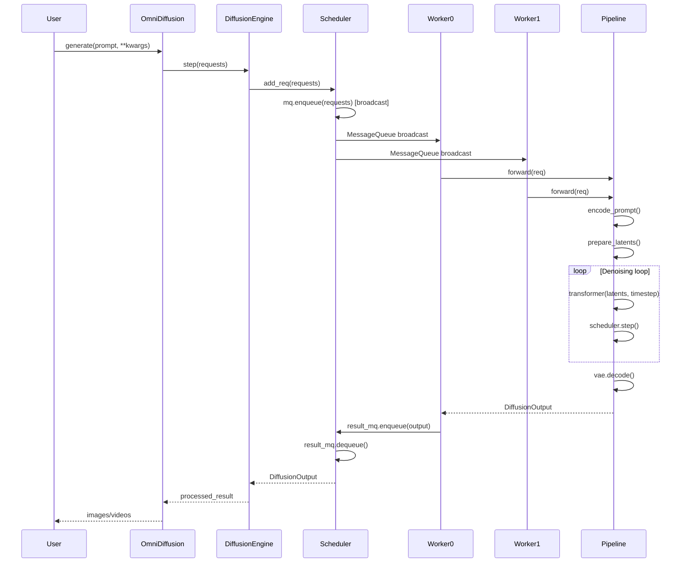

# Diffusion Engine Core Design

This document describes the design and architecture of the diffusion engine core in vLLM-Omni. The diffusion engine core handles inference for Diffusion Transformer (DiT) models, providing efficient execution for non-autoregressive generation tasks such as image and video generation.

## Architecture

The Diffusion Engine Core follows a multi-process architecture similar to vLLM's worker pattern, adapted for diffusion model requirements. Unlike LLM's fine-grained scheduling, diffusion models use broadcast-based data parallelism where all workers process the same request simultaneously.

```
┌─────────────────────────────────────────────────────────────┐
│                      DiffusionEngine                         │
│  ┌──────────────┐  ┌──────────────┐  ┌─────────────────┐  │
│  │  Pre-process │  │   Scheduler  │  │  Post-process   │  │
│  │    Func      │  │              │  │     Func        │  │
│  └──────────────┘  └──────────────┘  └─────────────────┘  │
└─────────────────────────────────────────────────────────────┘
                          │
                          ▼
              ┌───────────────────────┐
              │   MessageQueue (MQ)   │
              │   Broadcast Handle    │
              └───────────────────────┘
                          │
              ┌───────────┴───────────┐
              │                       │
              ▼                       ▼
    ┌──────────────────┐    ┌──────────────────┐
    │  Worker Process  │    │  Worker Process  │
    │    (GPU 0)       │    │    (GPU 1)       │
    │                  │    │                  │
    │  ┌────────────┐  │    │  ┌────────────┐  │
    │  │ GPUWorker  │  │    │  │ GPUWorker  │  │
    │  └─────┬──────┘  │    │  └─────┬──────┘  │
    │        │         │    │        │         │
    │  ┌─────▼──────┐  │    │  ┌─────▼──────┐  │
    │  │  Pipeline  │  │    │  │  Pipeline  │  │
    │  │  (DiT)     │  │    │  │  (DiT)     │  │
    │  └────────────┘  │    │  └────────────┘  │
    └────────┬─────────┘    └────────┬─────────┘
             │                       │
             └───────────┬───────────┘
                         ▼
              ┌───────────────────────┐
              │   Result Queue (MQ)   │
              │   (Rank 0 only)       │
              └───────────────────────┘
```

## Components

### DiffusionEngine

The main entry point for diffusion model inference. It manages worker processes and coordinates request processing through the scheduler.

The code for `DiffusionEngine` can be found in `vllm_omni/diffusion/diffusion_engine.py`.

### Scheduler

A singleton scheduler that manages request distribution using ZeroMQ MessageQueue for inter-process communication. It broadcasts requests to all workers via shared memory MessageQueue and collects results from rank 0 only.

The code for `Scheduler` can be found in `vllm_omni/diffusion/scheduler.py`.

### Worker

A worker is a process that runs the model inference on a dedicated GPU. Each worker loads a full copy of the diffusion pipeline and executes independent forward passes.

**WorkerProc** wraps the execution logic:
- Receives requests from broadcast MessageQueue
- Executes model inference via `GPUWorker`
- Sends results back through result MessageQueue (rank 0 only)

**GPUWorker** manages model execution:
- Initializes distributed environment (NCCL, model parallel groups)
- Loads the diffusion pipeline via `DiffusersPipelineLoader`
- Sets up cache backends if configured
- Executes forward passes through the pipeline

The code for worker can be found in `vllm_omni/diffusion/worker/gpu_worker.py`.

### Diffusion Pipeline

The pipeline is the core model implementation, loaded by each worker. It serves the same role as vLLM's Model class but implements diffusion-specific logic.

**Pipeline structure:**
```python
class DiffusionPipeline(nn.Module):
    def __init__(self, od_config):
        self.transformer = DiT_Transformer(...)  # Diffusion Transformer
        self.vae = VAE(...)                      # Variational Autoencoder
        self.text_encoder = TextEncoder(...)     # Text encoder
        self.scheduler = Scheduler(...)          # Noise scheduler
    
    def forward(self, req: OmniDiffusionRequest):
        prompt_embeds = self.encode_prompt(req.prompt)
        latents = self.prepare_latents(req)
        for timestep in timesteps:
            noise_pred = self.transformer(latents, timestep, prompt_embeds)
            latents = self.scheduler.step(noise_pred, timestep, latents)
        images = self.vae.decode(latents)
        return images
```

Supported pipeline types include `QwenImagePipeline`, `QwenImageEditPipeline`, `OvisImagePipeline`, `LongCatImagePipeline`, `Wan22Pipeline`, and custom pipelines via model registry.

The code for pipelines can be found in `vllm_omni/diffusion/models/`.

### OmniDiffusionRequest

A dataclass that encapsulates all information needed for diffusion inference, including prompts, embeddings, generation parameters, latents, and execution state.

The code for `OmniDiffusionRequest` can be found in `vllm_omni/diffusion/request.py`.

### Cache Backend

Unified interface for applying acceleration techniques that cache intermediate computations.

**Supported backends:**

**TeaCache** (`tea_cache`): Timestep Embedding Aware Cache that caches transformer block outputs when consecutive timestep embeddings are similar. Configurable via `rel_l1_thresh` parameter.

**Cache-DiT** (`cache_dit`): Implements DBCache (Diffusion Block Cache) with support for SCM (Sparse Cached Mask) and TaylorSeer. More aggressive caching with configurable compute blocks and warmup steps.

Cache backends are enabled during worker initialization and refreshed before each generation.

The code for cache backends can be found in `vllm_omni/diffusion/cache/`.

## Data Flow



1. User creates requests via `OmniDiffusion.generate()` with prompts and parameters
2. Requests are enqueued to MessageQueue, which broadcasts to all workers
3. Each worker receives the same request and executes the pipeline:
   - Encode prompt to embeddings
   - Prepare latents (noise or VAE-encoded)
   - Denoising loop: transformer forward pass and scheduler step
   - Decode latents to images/videos via VAE
4. Rank 0 worker sends results back via result MessageQueue
5. Results are post-processed and returned to user

## Key Design Decisions

### Broadcast vs Fine-grained Scheduling

**LLM Engine**: Fine-grained scheduling with attention mechanisms. Each worker processes different sequences/prefixes with complex KV cache management across workers.

**Diffusion Engine**: Broadcast-based request distribution. All workers process the same request for data parallelism with simpler state management (no cross-worker attention).

### Shared Memory Communication

Uses ZeroMQ MessageQueue built on shared memory for efficient IPC, avoiding serialization overhead for large tensors and supporting one-to-many broadcast pattern natively.

### Result Handling

Only rank 0 sends results back to avoid duplicate responses. Results are collected synchronously (blocking call).

## Parallelism Strategies

The diffusion engine supports multiple parallelism strategies via `DiffusionParallelConfig`:

- **Tensor Parallelism (TP)**: Splits transformer layers across GPUs, reduces memory per GPU, requires communication during forward pass
- **Data Parallelism (DP)**: Each GPU processes the full model with independent forward passes
- **Classifier-Free Guidance Parallelism (CFG)**: Parallel execution of positive and negative prompts
- **Sequence Parallelism**: Splits sequence dimension across GPUs (Ulysses for head splitting, Ring for token splitting)
- **Pipeline Parallelism**: Splits model stages across GPUs (currently limited support)

## Performance Optimizations

### Cache Acceleration

**TeaCache**: Automatic detection of similar timestep embeddings with configurable threshold for quality/speed tradeoff.

**Cache-DiT (DBCache)**: More aggressive caching with configurable compute blocks, warmup steps, and support for SCM and TaylorSeer strategies.

### Attention Optimization

Support for Flash Attention, SDPA, and custom attention backends. Third-party integrations include FA3, SAGE, and MindIE-SD. Sliding Tile Attention (STA) for long sequences.

### Memory Optimization

CPU offloading for encoder/decoder components, VAE slicing and tiling for large images, configurable dtype (bfloat16, float16, float32).

### Compilation

Optional PyTorch compilation (`torch.compile`) for faster inference.

## Comparison with LLM Engine

| Aspect | LLM Engine | Diffusion Engine |
|--------|-----------|------------------|
| **Scheduling** | Fine-grained, per-token | Broadcast, per-request |
| **State Management** | KV cache across workers | Independent per worker |
| **Communication** | Frequent all-reduce | Minimal (results only) |
| **Processing** | Sequential token generation | Iterative denoising |
| **Batching** | Dynamic batching | Static request batches |
| **Cache Strategy** | KV cache | Timestep-aware cache |
